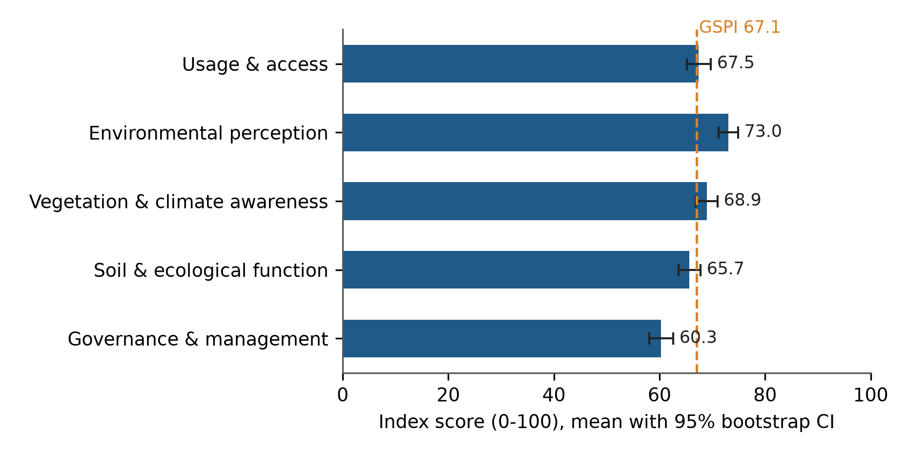
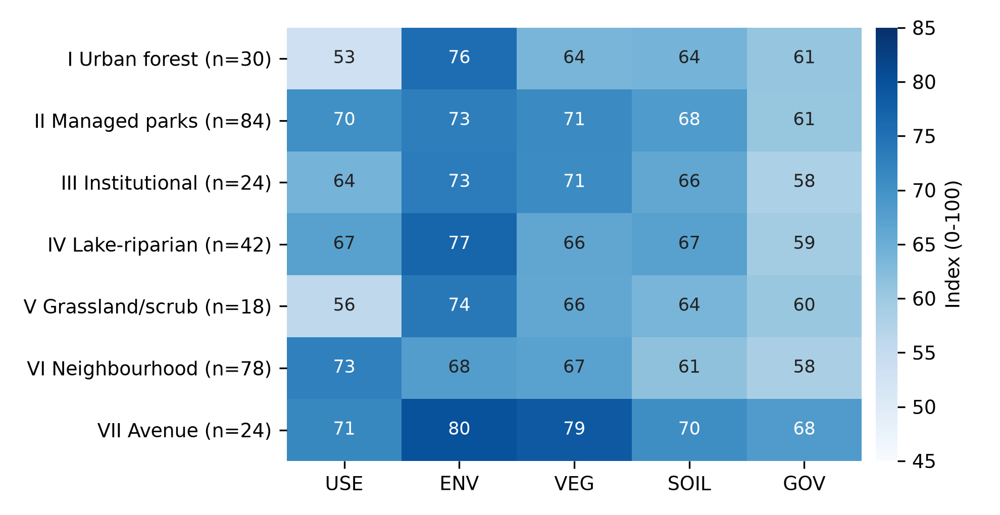
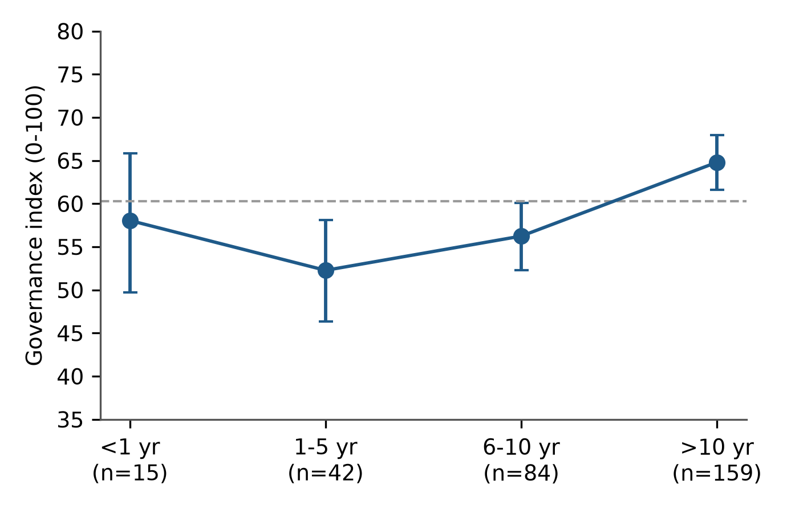
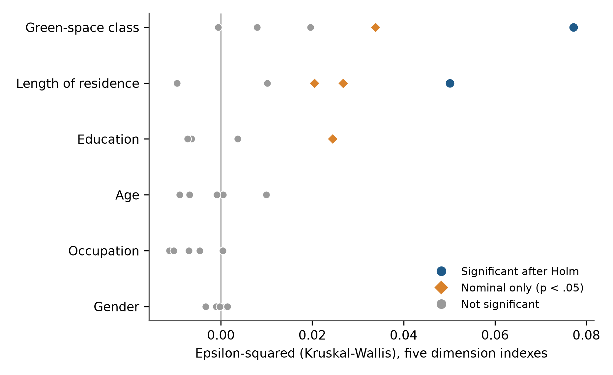
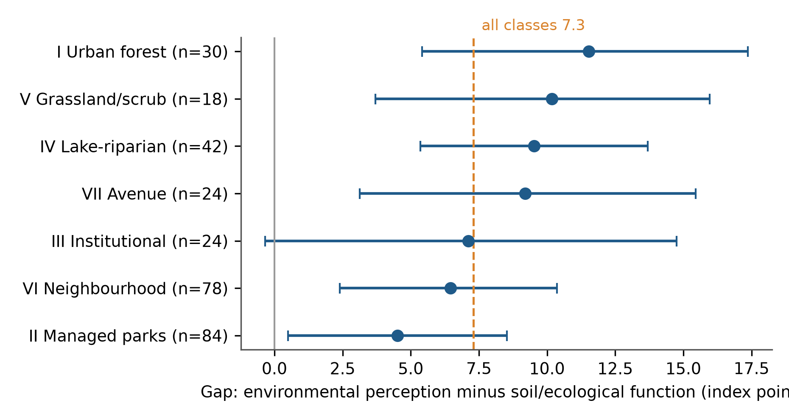

# Valued but hard to reach and poorly managed: community perceptions of seven types of urban green space in Bengaluru, India

**Vishnu H V**ᵃ*, **N. Nandini**ᵃ

ᵃ Department of Environmental Science, Bangalore University, Jnana Bharathi Campus, Bengaluru 560 056, Karnataka, India

\* Corresponding author. *[e-mail to be added]*

*Target journal: Urban Forestry & Urban Greening (Elsevier). Formatting follows that journal's structure (Highlights, structured sections, CRediT, declarations). Author order, affiliations and the declarations marked [CONFIRM] are for the authors to confirm.*

---

## Highlights

- 300 Bengaluru residents rated one of seven mapped green-space classes on 29 items.
- A five-dimension perception instrument showed good fit and reliability (CFI = 0.99).
- Environmental benefits were rated highest (73.0/100) and governance lowest (60.3/100).
- Ecological-function endorsement trailed environmental appreciation (7.3 points; all classes).
- Only class (access) and residence length (governance) effects survived multiple-test correction.

---

## Abstract

**Background.** Cities in the Global South are losing green cover quickly, yet we know little about how residents perceive the different kinds of green space that remain. Perception studies usually treat "green space" as a single category, which hides differences that matter for planning.

**Methods.** We surveyed 300 adult residents of Bengaluru Urban district with a 35-item questionnaire, in English or Kannada, using Google Forms and face-to-face interviews. Each respondent answered for the class of green space they visit most often, drawn from a seven-class functional typology (urban forest, managed parks, institutional greens, lake-riparian systems, grassland/scrub, neighbourhood parks, avenue plantations). Twenty-nine five-point Likert items formed five dimensions: usage and access, environmental perception, vegetation and climate awareness, soil and ecological function, and governance. We tested dimensionality (CFA, EFA, parallel analysis), reliability, and differences by class and respondent characteristics (Kruskal–Wallis tests with Holm correction across 36 tests). We tested the appreciation–awareness gap with a paired Wilcoxon test and bootstrap confidence intervals.

**Results.** A five-factor model fitted well (χ²(367) = 406.1, CFI = 0.988, RMSEA = 0.019) and far better than a single factor (CFI = 0.712). Cronbach's α ranged from 0.80 to 0.86. Environmental perception scored highest (73.0 on a 0–100 scale) and governance lowest (60.3). Residents endorsed the ecological functions of green space less strongly than its environmental benefits (gap 7.3 points, 95% CI 5.4–9.3; Wilcoxon *p* < 0.001; *d*z = 0.42), and the gap was positive in all seven classes. It did not differ significantly among classes (*p* = 0.40). Of 36 group tests, seven were nominally significant and two survived Holm correction: green-space class affected usage and access (ε² = 0.077; urban forest and grassland/scrub were least accessible), and longer residence was associated with higher governance ratings (ε² = 0.050). Age, gender and occupation showed no detectable effects.

**Conclusions.** Residents value what green space does for the local environment but rate its management poorly, and they under-endorse its less visible ecological functions. Access, not appreciation, separates the classes. Interventions should target maintenance and visible management first, and should add access and interpretation where urban forest and scrubland are concerned. The sample is quota-balanced and cross-sectional, so the results describe associations in this sample and do not give population prevalence.

**Keywords:** urban green space typology; public perception; Bengaluru; confirmatory factor analysis; governance; ecosystem awareness; Global South

---

## 1. Introduction

Bengaluru is still called the Garden City, but the label describes its past better than its present. Satellite studies document a steep decline in vegetation cover and a several-fold rise in built-up area over recent decades (Ramachandra et al., 2015; Nagendra et al., 2012), and street-tree surveys show that what remains is unevenly distributed (Nagendra and Gopal, 2010). Whether the remaining green space actually delivers the benefits attributed to it depends partly on how people see it. Residents decide whether to visit a park, whether to support its protection, and whether to trust the authority that manages it. Those decisions rest on perception, so measuring perception is a necessary complement to measuring vegetation.

The international evidence is large. Restoration theories hold that natural settings are experienced directly, through their felt environmental quality (Kaplan, 1995; Ulrich et al., 1991). Reviews link green space structure, biodiversity and naturalness to well-being, and note that most studies rely on users' perceptions, so the congruence between perception and objective measurement remains open (Reyes-Riveros et al., 2021). Surveys in Guangzhou found that residents appreciated green space for its microclimate and scenic benefits but gave limited weight to its wider ecological functions (Jim and Chen, 2006). In Bengaluru, work along the rural–urban gradient has related well-being to tree cover (Thapa et al., 2024) and has documented how residents perceive lakes as ecosystem service providers (Plieninger et al., 2022). Equity concerns run through this literature: greening that ignores who can reach and who controls green space risks reproducing disadvantage (Wolch et al., 2014).

Three gaps limit what this evidence can tell Bengaluru's planners. First, most perception studies treat "green space" as one category, although the term carries different meanings across disciplines and the definition changes what is being compared (Taylor and Hochuli, 2017). A resident answering about Lalbagh and one answering about a roadside avenue are not describing the same thing. Second, perception is often collapsed into a single satisfaction score, although access, environmental experience, ecological understanding and trust in management may behave differently. Third, the instruments are rarely tested for dimensionality, so the reported "dimensions" are assumed and not demonstrated.

This paper addresses these gaps with a survey in which every respondent answered about one class of a seven-class functional typology of green space, and in which the instrument was tested for its factor structure and reliability before group differences were interpreted. The typology comes from the wider study of which this survey is one component; it divides the district's green space into urban forest, managed parks and botanical gardens, institutional green complexes, lake-riparian systems, grassland and scrubland, neighbourhood and community parks, and avenue plantations. We ask four questions.

1. **RQ1.** Does a five-dimension structure (usage and access, environmental perception, vegetation and climate awareness, soil and ecological function, governance) describe the data, and are the dimensions reliable?
2. **RQ2.** How do residents rate the five dimensions overall?
3. **RQ3.** Do ratings differ by green-space class and by respondent characteristics, once multiple testing is accounted for?
4. **RQ4.** Do residents endorse the ecological functions of green space less than its visible environmental benefits, and does that gap differ among classes?

Our working expectation, drawn from Jim and Chen (2006), was that appreciation would exceed ecological awareness (H4 of the wider study). We had no directional expectation for the class differences, and we treated the demographic comparisons as exploratory.

---

## 2. Materials and methods

### 2.1 Study area and green-space typology

The study covers Bengaluru Urban district in Karnataka, southern India (about 12.97° N, 77.59° E; about 800–960 m above sea level), a district that spans the dense urban core, the peri-urban transition and an agricultural and scrub-dominated fringe. Its population exceeded nine million at the 2011 Census. Green space was classified into seven functional classes from Sentinel-2 imagery in a companion analysis: Class I, urban forest and reserved natural systems; Class II, managed public parks and botanical gardens; Class III, institutional green complexes; Class IV, lake-riparian and blue-green systems; Class V, grassland and scrubland; Class VI, neighbourhood and community parks; and Class VII, avenue plantations and linear greens. The questionnaire gave each class a plain-language description with local examples (for instance, Turahalli for Class I, Lalbagh and Cubbon Park for Class II, and Sankey Tank and Agara Lake for Class IV), so that respondents could place their own most-visited green space into a class without technical knowledge.

### 2.2 Instrument

The questionnaire (35 items) had a short consent statement followed by five parts. Part A recorded five demographic variables: age group, gender, education, occupation and length of residence in Bengaluru. Section 1 asked respondents to select the one class of green space they visit most often (Q6) and then rated five usage and access statements (Q7–Q11). Sections 2 to 5 contained six statements each: environmental perception (Q12–Q17), vegetation and climate awareness (Q18–Q23), soil and ecological function awareness (Q24–Q29) and governance, management and threat perception (Q30–Q35). All 29 statements used a five-point agreement scale (1 = strongly disagree to 5 = strongly agree; Likert, 1932), with "neutral/unsure" as the midpoint. Respondents were told to answer for the one class they had chosen. The English questionnaire was also administered in Kannada. Items were worded positively; no item was reverse-keyed. The full item wording is given in Supplementary Table S1.

Item Q31 ("Urban development threatens green spaces") and items Q34 and Q35 (support for conservation; improved management would help) measure threat awareness and willingness rather than an evaluation of current management. We kept them in the governance dimension, as the instrument was designed, and checked the effect of removing them (Section 3.6).

### 2.3 Sampling and data collection

The survey was a cross-sectional questionnaire study of adult residents of Bengaluru. We used purposive quota sampling to ensure that each group had enough respondents for comparison and that no single group dominated: the quotas were five age bands of 60 respondents each (18–25, 26–35, 36–45, 46–60, above 60), four education levels of 75 each, five occupation groups of 60 each (student, private sector, public sector, self-employed, retired), and a 60:40 male-to-female ratio (180 men, 120 women). Length of residence and green-space class were not under quota; they reflect who responded and which class each respondent chose. The first author collected all 300 responses personally, through an online form (Google Forms) and through face-to-face interviews in which the author read the items and recorded the answers, with the choice of mode and language left to the respondent. No enumerators were employed. [CONFIRM: the split between online and interview responses, and how the quotas were filled, so that this paragraph states them exactly.]

The quota design trades representativeness for balanced comparison. The sample is not representative of Bengaluru's population; it over-represents older age groups, postgraduate and doctoral respondents and the retired relative to the city, and results are not weighted. We therefore read prevalence figures (for example, percentage agreeing) as descriptions of this sample, and we emphasise differences between groups and dimensions over absolute levels.

### 2.4 Ethics

Participation was voluntary and anonymous. The questionnaire opened with an information and consent statement, and no names, contact details or other personal identifiers were collected. The questions concerned opinions about green space and basic demographic categories and contained no sensitive, health or personal-history items. Formal approval from an institutional ethics committee was not sought for this survey. [CONFIRM: check whether the target journal accepts this statement; Elsevier journals often require either approval or an explicit exemption statement from the institution.]

### 2.5 Measures

For each respondent we calculated five dimension indexes as the mean of the items in each dimension (Q7–Q11, Q12–Q17, Q18–Q23, Q24–Q29, Q30–Q35). The Green Space Perception Index (GSPI) is the mean of the five dimension indexes. Indexes were rescaled to 0–100 as (mean − 1) / 4 × 100 so that dimensions read on a common scale. There were no missing responses, no respondent gave the same answer to all 29 items, and there were no duplicate response patterns.

### 2.6 Statistical analysis

**Dimensionality and reliability.** We examined factorability with the Kaiser–Meyer–Olkin (KMO) measure (Kaiser, 1974) and Bartlett's test. We extracted components from the correlation matrix, retained them by the Kaiser criterion and by Horn's (1965) parallel analysis (500 random datasets, 95th percentile), and rotated them by varimax. We then fitted a five-factor confirmatory factor analysis (CFA; each item loading on its designed factor, factors correlated, maximum likelihood) and compared it with a single-factor model. We judged fit by χ²/df, CFI, TLI, RMSEA and SRMR against conventional cut-offs (Hu and Bentler, 1999). We report Cronbach's α (Cronbach, 1951), McDonald's ω and average variance extracted (AVE) for each dimension, and we checked discriminant validity with the Fornell–Larcker criterion (Fornell and Larcker, 1981). As a screen for common-method variance we report the share of variance carried by the first unrotated component (Podsakoff et al., 2003).

**Group differences.** Because Likert-derived indexes are ordinal and several are skewed, our primary tests were Kruskal–Wallis tests, with ε² as the effect size (Tomczak and Tomczak, 2014). The confirmatory family was fixed in advance of looking at the results: six grouping variables (class, length of residence, education, age, occupation, gender) crossed with the five dimension indexes and the GSPI, 36 tests in all. We controlled the family-wise error rate with the Holm (1979) procedure and report both raw and adjusted *p*-values. For tests that survived adjustment we ran pairwise Mann–Whitney tests with Holm correction and report rank-biserial correlations. As a robustness check, we regressed the GSPI on all six categorical variables by ordinary least squares with HC3 robust standard errors (treating the index as approximately interval, Norman, 2010).

**Appreciation–awareness gap.** We defined environmental perception (Q12–Q17: cooling, air quality, noise, shade, seasonal moderation, overall quality) as residents' appreciation of the visible benefits of green space, and soil and ecological function (Q24–Q29: soil condition, biodiversity, rainwater absorption, ground cover, ecological benefits beyond recreation, protecting functions) as their endorsement of its ecological functions. The gap is the difference between the two indexes (0–100 scale), tested with a paired Wilcoxon signed-rank test and summarised by its mean and a 5,000-resample percentile bootstrap 95% confidence interval, overall and within each class. We tested whether the gap differed among classes with a Kruskal–Wallis test. The two dimensions contain different items, so the gap measures relative endorsement and not a like-for-like difference in knowledge; the instrument contains no knowledge test.

All analyses used Python 3.11 (NumPy, SciPy, statsmodels); the CFA was fitted by direct maximum-likelihood minimisation of the model discrepancy function. The analysis script reproduces every number reported here from the response file.

---

## 3. Results

### 3.1 Sample profile

By design, the age bands, education levels and occupation groups were balanced (Table 1). Most respondents (53.0%) had lived in Bengaluru for more than ten years and only 5.0% for less than one year. Managed parks (28.0%) and neighbourhood parks (26.0%) were the classes most often named as the most-visited space; grassland/scrub (6.0%), institutional greens (8.0%) and avenues (8.0%) were named least often. These class sizes are an outcome of respondent choice, not of design, and they limit what we can say about the small classes.

**Table 1. Sample profile (N = 300).**

| Variable | Category | n | % |
|---|---|---|---|
| Age (years) | 18–25 / 26–35 / 36–45 / 46–60 / above 60 | 60 each | 20.0 each |
| Gender | Male / Female | 180 / 120 | 60.0 / 40.0 |
| Education | Secondary or below / Undergraduate / Postgraduate / Doctoral | 75 each | 25.0 each |
| Occupation | Student / Private / Public / Self-employed / Retired | 60 each | 20.0 each |
| Residence in Bengaluru | <1 yr / 1–5 yr / 6–10 yr / >10 yr | 15 / 42 / 84 / 159 | 5.0 / 14.0 / 28.0 / 53.0 |
| Class most visited | I Urban forest | 30 | 10.0 |
| | II Managed parks | 84 | 28.0 |
| | III Institutional | 24 | 8.0 |
| | IV Lake-riparian | 42 | 14.0 |
| | V Grassland/scrub | 18 | 6.0 |
| | VI Neighbourhood | 78 | 26.0 |
| | VII Avenue | 24 | 8.0 |

### 3.2 Item-level responses

Across all 29 items and 300 respondents, 58.3% of responses were "agree" or "strongly agree", 29.0% were neutral and 12.8% were "disagree" or "strongly disagree". Item means ranged from 3.37 to 3.94 on the five-point scale, with standard deviations of 0.92 to 1.09 (Supplementary Table S2). The three highest-rated items all belonged to the environmental dimension: overall environmental quality (Q17, M = 3.93), moderation of seasonal conditions (Q16, M = 3.94) and shade (Q15, M = 3.92), each with about 68–70% agreement. The three lowest-rated items were all in the governance dimension: support for conservation initiatives (Q34, M = 3.37; 43.7% agreement), the perceived threat from urban development (Q31, M = 3.39) and the expectation that better management would help (Q35, M = 3.40). Item skewness was small (−0.67 to 0.02), so a ceiling effect is not a concern.

### 3.3 Dimensionality and reliability (RQ1)

The correlation matrix was suitable for factor analysis (KMO = 0.928; Bartlett's χ²(406) = 3525.9, *p* < 0.001). The first five eigenvalues were 9.37, 2.47, 1.67, 1.63 and 1.21; the Kaiser criterion therefore suggested five components, whereas parallel analysis, which compares each eigenvalue with the 95th percentile of random data (1.71, 1.60, 1.52, 1.46, 1.40), supported four (Fig. S1). The fifth eigenvalue fell below the random-data benchmark by a modest margin. A five-component varimax solution explained 56.4% of the variance and reproduced the designed structure exactly: every item loaded most strongly on its intended component (smallest primary loading 0.51), and no item loaded 0.40 or above on a second component (Supplementary Table S3).

The five-factor CFA fitted the data well (χ²(367) = 406.1, χ²/df = 1.11, CFI = 0.988, TLI = 0.987, RMSEA = 0.019, SRMR = 0.040), and it fitted far better than a single-factor model (χ²(377) = 1312.8, CFI = 0.712, RMSEA = 0.091; Δχ²(10) = 906.7, *p* < 0.001). The first unrotated component carried 32.3% of the variance, well below the 50% level that would signal a dominant common-method factor, although this screen is crude and does not rule out method variance.

All five dimensions were reliable (Table 2). Cronbach's α ran from 0.80 to 0.86 and McDonald's ω matched it; α for the full 29-item scale was 0.92. Standardised CFA loadings ranged from 0.58 to 0.77. AVE was close to or below the usual 0.50 benchmark (0.40–0.52), which is common for Likert scales with moderate loadings but means convergent validity is adequate, not strong. Discriminant validity was only partly established: latent factor correlations ranged from 0.31 to 0.72, and the Fornell–Larcker criterion was not met for every pair, with the largest overlap between vegetation/climate awareness and soil/ecological function (*r* = 0.72). We therefore treat the five dimensions as related but separable, and we do not interpret differences between those two in isolation from the others.

**Table 2. Reliability and convergent validity of the five dimensions.**

| Dimension | Items | α | ω | AVE | Standardised loadings |
|---|---|---|---|---|---|
| Usage and access | 5 | 0.843 | 0.843 | 0.518 | 0.69–0.75 |
| Environmental perception | 6 | 0.798 | 0.798 | 0.397 | 0.58–0.69 |
| Vegetation and climate awareness | 6 | 0.840 | 0.840 | 0.468 | 0.66–0.75 |
| Soil and ecological function | 6 | 0.824 | 0.825 | 0.441 | 0.59–0.70 |
| Governance and management | 6 | 0.858 | 0.859 | 0.504 | 0.67–0.77 |

### 3.4 Overall perception profile (RQ2)

Environmental perception had the highest mean index (73.0, 95% CI 71.2–74.9), followed by vegetation and climate awareness (68.9, 66.8–71.0), usage and access (67.4, 65.2–69.7) and soil and ecological function (65.7, 63.6–67.8). Governance and management scored lowest (60.3, 58.1–62.6). The overall GSPI was 67.1 (65.5–68.7) (Fig. 1). The paired differences were consistent: environmental perception exceeded governance by 12.7 points (Wilcoxon *p* < 0.001) and soil and ecological function exceeded governance by 5.3 points (*p* < 0.001).

**Fig. 1.** Mean perception indexes (0–100) with 95% bootstrap confidence intervals. The dashed line marks the overall GSPI.

### 3.5 Differences by class and respondent characteristics (RQ3)

Of the 36 tests in the confirmatory family, seven were nominally significant (*p* < 0.05) and two remained significant after Holm correction (Fig. 4; Supplementary Table S4).

**Green-space class and usage and access.** Class differed strongly in usage and access (H(6) = 28.6, *p* = 0.0001, Holm *p* = 0.003, ε² = 0.077). Urban forest scored lowest (53.2) and grassland/scrub next (55.8), against 70.2 for managed parks, 72.6 for neighbourhood parks and 71.5 for avenues (Fig. 2). After Holm correction, urban forest was rated less accessible than managed parks, lake-riparian systems, neighbourhood parks and avenues (rank-biserial *r* between −0.43 and −0.54), and grassland/scrub less accessible than neighbourhood parks (*r* = −0.48). The class effect on environmental perception was nominally significant (H(6) = 15.9, *p* = 0.014) but did not survive correction (Holm *p* = 0.46).

**Fig. 2.** Mean perception index (0–100) for each dimension by green-space class. USE, usage and access; ENV, environmental perception; VEG, vegetation and climate awareness; SOIL, soil and ecological function; GOV, governance and management.

**Length of residence and governance.** Governance ratings rose with length of residence (H(3) = 17.8, *p* = 0.0005, Holm *p* = 0.017, ε² = 0.050; Fig. 5). Residents of more than ten years rated governance higher (64.8) than those of 1–5 years (52.3; *r* = −0.34) and 6–10 years (56.2; *r* = −0.25), after Holm correction. The difference between the shortest residents (<1 year, n = 15, 58.1) and others could not be resolved because that group is small. Residence also showed nominal effects on vegetation awareness, soil/ecological function and the GSPI that did not survive correction.

**Fig. 3.** Governance index by length of residence (mean with 95% bootstrap CI); dashed line is the overall mean.

**Other characteristics.** Education had one nominal effect, on vegetation awareness (H(3) = 10.2, *p* = 0.017; Holm *p* = 0.52). Age, gender and occupation showed no effects at the uncorrected level on any dimension (Fig. 4). In the GSPI regression, the model explained little variance (R² = 0.101, adjusted R² = 0.034); one coefficient (avenue plantations, β = 0.43, *p* = 0.008) was nominally significant and none survived Holm correction.

**Fig. 4.** Effect sizes (ε²) for the 30 tests on the five dimension indexes, by grouping variable. Blue circles survived Holm correction across all 36 tests; orange diamonds were nominally significant only.

### 3.6 Appreciation versus ecological-function endorsement (RQ4)

Residents rated the visible environmental benefits of green space higher than its ecological functions. The mean gap was 7.3 points (95% CI 5.4–9.3; Wilcoxon *p* < 0.001; *d*z = 0.42); 62.7% of respondents scored environmental perception above soil/ecological function, 9.7% scored them equally and 27.6% scored them lower. The gap was positive in all seven classes (Fig. 5; Supplementary Table S5). It ranged from 4.5 points in managed parks to 11.5 in urban forest, and the 95% confidence interval excluded zero in six of seven classes (institutional greens, n = 24: 7.1, CI −0.3 to 14.8). The gap did not differ significantly among classes (H(6) = 6.20, *p* = 0.40). A post hoc grouping of the two least accessible classes, urban forest and grassland/scrub (n = 48, gap 11.0), against the rest (n = 252, gap 6.6) was not significant (*p* = 0.12). We therefore report the larger gaps in urban forest, grassland/scrub and lake-riparian systems as descriptive tendencies and we do not claim that the gap is class-specific.

**Fig. 5.** Gap between environmental perception and soil/ecological function endorsement (index points) by class, with 95% bootstrap CIs. Dashed line, overall mean; solid grey line, zero.

**Sensitivity.** Items Q31, Q34 and Q35 are not evaluations of current management. A "core" governance index from Q30, Q32 and Q33 alone (α = 0.72) gave the same residence effect (H(3) = 17.6, *p* = 0.0005, ε² = 0.049), so the residence–governance finding does not depend on those items.

---

## 4. Discussion

### 4.1 What residents value, and what they do not

Residents in this sample rated the felt environmental benefits of green space highest and its management lowest. This ordering is what restoration theory would predict, because cooling, shade and air quality are experienced directly, whereas governance is largely invisible until it fails (Kaplan, 1995; Ulrich et al., 1991). It also matches reports from other cities that residents readily recognise microclimate and amenity benefits but give less weight to wider ecological functions (Jim and Chen, 2006).

The gap between environmental appreciation and ecological-function endorsement (7.3 points, a small-to-moderate effect) supports the working expectation that appreciation exceeds ecological awareness. Two points limit how far we can push this. The two dimensions contain different items, so the gap shows relative endorsement; it is not evidence that residents lack ecological knowledge, which the instrument does not test. And the gap is modest: respondents still endorsed soil and ecological functions well above the scale midpoint (65.7). The more useful reading is that ecological functions, though endorsed, are less salient than the benefits people feel.

The gap was positive in every class and we found no evidence that it differs among them. We expected larger gaps in the classes that store most carbon, and the point estimates lean that way (urban forest 11.5, lake-riparian 9.5, grassland/scrub 10.2), but the pattern is not statistically supported and the small classes carry wide intervals. We report it as a hypothesis for a larger sample.

### 4.2 Access, not appreciation, separates the classes

The only strong class effect was on usage and access. Urban forest and grassland/scrub were the classes least reached, while neighbourhood parks, managed parks and avenues were the most reached. Appreciation of environmental benefit was high in all classes, including those rated least accessible, so low access did not coincide with low regard. It suggests that closing access gaps to forest and scrub, not persuading residents of their value, is the planning task. Because the classes come from an independent land-cover typology, the result also speaks to the perception–objective congruence question that Reyes-Riveros et al. (2021) identify as open. The nominal differences in environmental perception between classes (highest for avenues, 79.7, and lowest for neighbourhood parks, 67.9) did not survive correction and should not be over-read.

The class effect also shows why a typology matters. A single "green space" question would have averaged over a 20-point spread in access.

### 4.3 Governance is the weakest link, and long-term residents are kinder

Governance was the lowest-rated dimension in five of the seven classes (in urban forest and grassland/scrub, usage and access was lower), and no class reached 70 on it. This is a fixable problem relative to most others in the study: perceived management quality depends on maintenance, signage, lighting, safety and visible upkeep, which a city can improve within a budget cycle. Wolch et al. (2014) caution that improving green space without attention to who benefits can displace the people it is meant to serve, so maintenance should be paired with access measures.

Longer residence was associated with higher governance ratings, contrary to the idea that long exposure breeds disillusion. Several explanations are possible: long-term residents may know whom to approach, may have seen improvements, or may be more attached to a place they know; newcomers may compare Bengaluru with cities they left. This cross-sectional design cannot tell these apart, and the shortest-tenure group is small (n = 15). We also note that the effect is of moderate size (ε² = 0.050) and that other dimensions' residence effects did not survive correction. The result echoes Thapa et al.'s (2024) finding in Bengaluru that wellbeing varied with social factors, but our evidence is limited to governance.

### 4.4 Limited demographic variation

Age, gender and occupation showed no detectable effect on any dimension, and education and residence had at most nominal effects on awareness. Quotas equalised group sizes, which helps comparisons, but the sample was not designed to represent income, ward or neighbourhood, which the instrument did not record. Studies elsewhere have found that socio-demographic groups differ in how they perceive and use green space (Lo and Jim, 2010), so the absence of demographic differences here should not be read as proof of equality in the wider city.

### 4.5 Methodological contribution

The five-dimension structure held up under CFA and EFA, with reliabilities of 0.80–0.86 and a clearly better fit than a single factor. Three caveats follow from the results. Parallel analysis favoured four factors, so the separation of the fifth is supported by the CFA comparison and by the designed item content more than by an eigenvalue test. AVE was modest and discriminant validity was partial, in particular between vegetation/climate awareness and soil/ecological function. And the CFA fit was very close (RMSEA 0.019), which deserves replication on an independent sample before others adopt the model. We therefore present the instrument as a reliable, structured profile and not as a validated scale.

### 4.6 Implications for planning and management

The findings suggest three actions, ordered by how directly the data support them.

1. **Make management visible.** Because governance ratings were lowest, visible upkeep (clean and lit paths, posted maintenance schedules, a named managing authority) is the quickest way to raise the experience of green space. Awareness of the managing authority (Q32) is itself a governance item.
2. **Close access gaps to forest and scrub.** Urban forest and grassland/scrub were the least accessible classes. Entry points, transport links and interpretation at these sites would convert existing regard into use, while access controls should respect their ecological sensitivity.
3. **Make ecological functions visible.** Interpretation about soil, water absorption and biodiversity at heavily used parks would address the modest under-endorsement of ecological functions where residents already go.

### 4.7 Limitations

Five limitations qualify these findings. (i) The sample is a quota-balanced purposive sample of 300 collected by one researcher and is not representative of Bengaluru, so levels (for example, percentage agreement) describe the sample and cannot be generalised. (ii) Respondents chose their own class, so class sizes are unequal (6% to 28%) and the small classes (grassland/scrub, n = 18; institutional and avenue, n = 24 each) have wide uncertainty; class differences also reflect who uses each class, not only the class itself. (iii) Perception is self-reported and cross-sectional, so we cannot infer causation or change over time, and acquiescence and social-desirability bias may inflate agreement with virtuous statements. (iv) The "awareness" dimensions are self-rated endorsements; they are not knowledge tests, and the environmental and ecological dimensions contain different items. (v) The governance dimension mixes evaluations of current management with threat awareness and support for conservation, although a sensitivity analysis showed that the residence effect did not depend on those items. The instrument was also not designed to capture income, ward or distance to the green space, which prevents tests of environmental-justice questions.

---

## 5. Conclusions

Residents of Bengaluru in this sample rate the environmental benefits of green space highly (73.0/100) and its governance poorly (60.3). They endorse its ecological functions less strongly than its visible benefits, by about seven points in every class. Green-space class separates the seven types by access, with urban forest and grassland/scrub the least reached, and longer-term residents rate governance higher than newcomers. Age, gender and occupation did not matter, and most other apparent effects disappeared once we corrected for 36 tests. The practical message is narrow and specific: improve and display management first, widen access to the least-reached classes, and tell residents what the less visible functions are. A larger, population-weighted survey that records ward and income, and that links each class's perception to measured carbon and soil data, is the natural next step.

---

## Declarations

**Funding.** [CONFIRM] No specific grant was received for this work.

**Declaration of competing interest.** The authors declare no competing interests. [CONFIRM]

**Ethics statement.** See Section 2.4. [CONFIRM against journal policy.]

**Data availability.** The anonymised response file and the analysis script are available from the corresponding author on reasonable request. [CONFIRM; consider a repository deposit.]

**CRediT authorship contribution statement.** Vishnu H V: Conceptualization, Methodology, Investigation, Data curation, Formal analysis, Writing – original draft. N. Nandini: Supervision, Conceptualization, Writing – review & editing. [CONFIRM]

**Declaration of generative AI use in the writing process.** During the preparation of this work the authors used Claude (Anthropic) to write and run the analysis scripts and to draft and edit the manuscript text. The authors reviewed and edited the output and take full responsibility for the content of the publication. [CONFIRM]

**Acknowledgements.** The authors thank the 300 residents who answered the survey. [CONFIRM]

---

## References

*Reference status.* Titles, years and journals for Thapa et al. (2024), Reyes-Riveros et al. (2021), Jim and Chen (2006) and Plieninger et al. (2022) were confirmed in this session against a scholarly database; the remaining entries are taken from the authors' synopsis reference list or standard methodological sources and must be checked against the publisher record (DOI, volume, pages) before submission.

Cronbach, L.J., 1951. Coefficient alpha and the internal structure of tests. Psychometrika 16(3), 297–334. https://doi.org/10.1007/BF02310555

Fornell, C., Larcker, D.F., 1981. Evaluating structural equation models with unobservable variables and measurement error. Journal of Marketing Research 18(1), 39–50.

Holm, S., 1979. A simple sequentially rejective multiple test procedure. Scandinavian Journal of Statistics 6(2), 65–70.

Horn, J.L., 1965. A rationale and test for the number of factors in factor analysis. Psychometrika 30(2), 179–185.

Hu, L., Bentler, P.M., 1999. Cutoff criteria for fit indexes in covariance structure analysis: Conventional criteria versus new alternatives. Structural Equation Modeling 6(1), 1–55.

Jim, C.Y., Chen, W.Y., 2006. Perception and attitude of residents toward urban green spaces in Guangzhou (China). Environmental Management 38(3), 338–349. https://doi.org/10.1007/s00267-005-0166-6

Kaiser, H.F., 1974. An index of factorial simplicity. Psychometrika 39(1), 31–36.

Kaplan, S., 1995. The restorative benefits of nature: Toward an integrative framework. Journal of Environmental Psychology 15(3), 169–182.

Likert, R., 1932. A technique for the measurement of attitudes. Archives of Psychology 22(140), 5–55.

Lo, A.Y.H., Jim, C.Y., 2010. Differential community effects on perception and use of urban greenspaces. Cities 27(6), 430–442. https://doi.org/10.1016/j.cities.2010.07.001

Nagendra, H., Gopal, D., 2010. Street trees in Bangalore: Density, diversity, composition and distribution. Urban Forestry & Urban Greening 9(2), 129–137. https://doi.org/10.1016/j.ufug.2009.12.005

Nagendra, H., Nagendran, S., Paul, S., Pareeth, S., 2012. Graying, greening and fragmentation in the rapidly expanding Indian city of Bangalore. Landscape and Urban Planning 105(4), 400–406. https://doi.org/10.1016/j.landurbplan.2012.01.014

Norman, G., 2010. Likert scales, levels of measurement and the "laws" of statistics. Advances in Health Sciences Education 15(5), 625–632.

Plieninger, T., et al., 2022. Disentangling ecosystem services perceptions from blue infrastructure around a rapidly expanding megacity. Landscape and Urban Planning. [volume/pages to be completed]

Podsakoff, P.M., MacKenzie, S.B., Lee, J.-Y., Podsakoff, N.P., 2003. Common method biases in behavioral research: A critical review of the literature and recommended remedies. Journal of Applied Psychology 88(5), 879–903.

Ramachandra, T.V., Bharath, A.H., Sowmyashree, M.V., 2015. Monitoring urbanization and its implications in a mega city from space: Spatiotemporal patterns and its indicators. Journal of Environmental Management 148, 67–81.

Reyes-Riveros, R., Altamirano, A., De La Barrera, F., Rozas-Vasquez, D., Vieli, L., Meli, P., 2021. Linking public urban green spaces and human well-being: A systematic review. Urban Forestry & Urban Greening 61, 127105.

Taylor, L., Hochuli, D.F., 2017. Defining greenspace: Multiple uses across multiple meanings. Landscape and Urban Planning 158, 25–38. https://doi.org/10.1016/j.landurbplan.2016.09.024

Thapa, P., Torralba, M., Nolke, N., Chappell, M., Wangchuk, S., Kleinn, C., 2024. Disentangling associations of human wellbeing with green infrastructure, degree of urbanity, and social factors around an Asian megacity. Landscape Ecology 39, 68.

Tomczak, M., Tomczak, E., 2014. The need to report effect size estimates revisited: An overview of some recommended measures of effect size. Trends in Sport Sciences 21(1), 19–25.

Ulrich, R.S., Simons, R.F., Losito, B.D., Fiorito, E., Miles, M.A., Zelson, M., 1991. Stress recovery during exposure to natural and urban environments. Journal of Environmental Psychology 11(3), 201–230.

Wolch, J.R., Byrne, J., Newell, J.P., 2014. Urban green space, public health, and environmental justice: The challenge of making cities "just green enough". Landscape and Urban Planning 125, 234–244.

---

## Supplementary material (to be uploaded with the submission)

- **Table S1.** Full questionnaire (35 items, English; Kannada version).
- **Table S2.** Item descriptives (mean, SD, % agree/neutral/disagree, skewness): `t_items.csv`.
- **Table S3.** Rotated component loadings: `t_efa_loadings.csv`.
- **Table S4.** All 36 group tests (H, df, raw and Holm *p*, ε²): `t_group_tests.csv`.
- **Table S5.** Appreciation–awareness gap by class: `t_gap_by_class.csv`.
- **Fig. S1.** Scree plot with parallel-analysis benchmark: `figs/figS1_scree.png`.
- **Code.** `analysis.py` (reproduces all numbers and figures).
